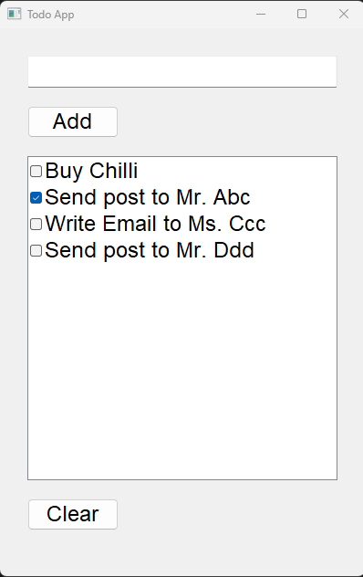

# Features
Initially tasks from 'tasks.txt' will be added on the app. On closing the App, tasks will be saved into the 'tasks.txt' file.   
1. Add Tasks: App text into the Input field and press 'Add' button  
2. Delete Task: select on the Task and then press on the 'Delete' button on the keyboard  
3. Clear all Tasks: All tasks will be cleared.  
